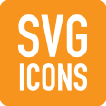
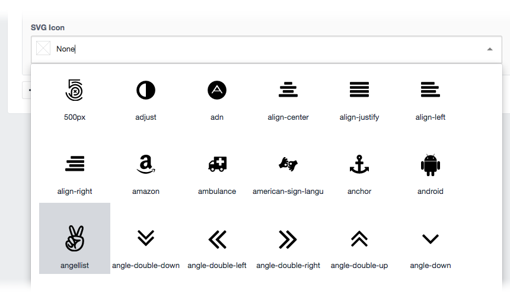

# SVG Icons plugin for Craft CMS

Easily access urls or inline SVG icons from a public directory.

## Installation

To install SVG Icons, follow these steps:

1. Download & unzip the file and place the `svgicons` directory into your `craft/plugins` directory
2.  -OR- do a `git clone https://github.com/fyrebase/svgicons.git` directly into your `craft/plugins` folder.  You can then update it with `git pull`
3.  -OR- install with Composer via `composer require fyrebase/svgicons`
4. Install plugin in the Craft Control Panel under Settings > Plugins
5. The plugin folder should be named `svgicons` for Craft to see it.  GitHub recently started appending `-master` (the branch name) to the name of the folder for zip file downloads.

SVG Icons works on Craft 2.6.x.

## SVG Icons Overview

The SVG Icons plugin allows you to quickly and easily access any set of SVG icons stored within your sites public directory (Shh, they don't just have to be icons).

To get started, simply create a directory called `svgicons` in your `public` directory and place a subdirectory containing your SVG icons within. You can add as many icon sets as you like.

Create a field using the `SVG Icons` field type and choose which icon set you would like to use.

## Configuring SVG Icons

SVG Icons comes with its own `config.php` which you can over ride by simply creating a `svgicons.php` in your Craft `config` directory.

**ENSURE SVG DOES NOT CONTAIN WIDTH & HEIGHT ATTRIBUTES IF YOU WOULD LIKE TO SCALE ICON WITH CSS**

### iconSetsPath [string]
*Default `$_SERVER['DOCUMENT_ROOT'] . '/svgicons/'`*
File system path to the folder where you want to store your icon sets.

### iconSetsUrl [string]
*Default `'/svgicons/'`*
The `iconSetsUrl` will be prepended to the path and filename of the icon.

## Using SVG Icons

### SvgIconsModel

Public attributes and methods of the `SvgIconsModel` model.

**`{{ svgIcon }}` [string]**

Returns icon public url

#### Attributes

`icon` *[string]*

The icon set path including icon file name

`width` *[number]*

The icon original width

`height` *[number]*

The icon original height

#### Methods

##### getInline

**`{{ svgIcon.inline }}` [string]**

Returns inlines icon

##### getUrl

**`{{ svgIcon.url }}` [string]**

Returns icon public URL

##### getDimensions

**`{{ svgIcon.dimensions }}` [array]**

Returns icon dimensions as array

##### setDimensions

**`{{ svgIcon.setDimensions(newHeight) }}` [array]**

Returns icon new dimensions in pixels as array maintaining aspect ratio

### Template Variables

#### Inline SVG Icon

**`{{ craft.svgIcons.inline(icon) }}` [string]**

Returns icon public URL

#### Get SVG Icon Dimensions

**`{{ craft.svgIcons.getDimensions(icon) }}` [array]**

Returns icon dimensions as array

#### Set SVG Icon Dimensions

**`{{ craft.svgIcons.setDimensions(icon, newHeight) }}` [array]**

Returns icon new dimensions in pixels as array maintaining aspect ratio

## SVG Icons Roadmap

Some things to do, and ideas for potential features:

* Release it

## SVG Icons Changelog

### 0.0.1 -- 2016.09.13

* Initial release

Brought to you by [Fyrebase](http://fyrebase.com)
